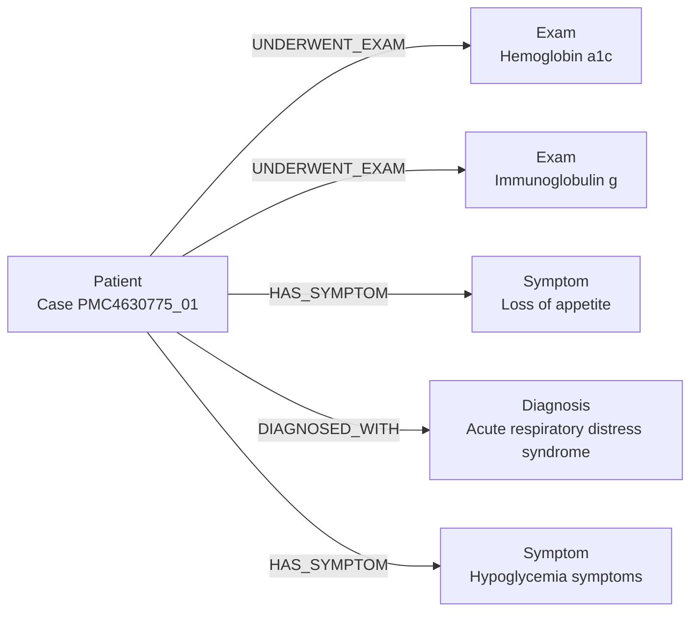

# Grupo Claude Code

## Slides

[Slides em pdf](./assets/slides/MC896-Projeto-1.pdf)

## Metodologia

### Extração dos dados

Inicialmente, extraímos os dados de casos clínicos do arquivo `cases.csv` e as informações dos pacientes do arquivo `metadata.csv`, unificando-os em um único dataset por meio de um merge pela coluna `article_id`:

### Tokenização

Utilizamos uma expressão regular (regex) que identifica três classes de tokens: números/notações, palavras e pontuações isoladas. Cada classe considera suas particularidades — por exemplo, notações científicas que, apesar de numéricas, possuem uma formatação diferente (como `10 x 10³`):

~~~python
token_re = re.compile(r"""
    \d+(?:\.\d+)?(?:\s*x\s*10\d*)?
    |[a-zA-Z]+
    |[.,;:!?()%/]
""", re.VERBOSE)
~~~

### Normalização

Em seguida, aplicamos uma normalização simples por meio da função `stem()`, que resolve plurais removendo o `s` final das palavras — exceto quando precedido de outro `s`, evitando remover incorretamente palavras terminadas em "ss" — e converte o token inteiramente para minúsculo:

~~~python
stem_re = re.compile(r'(?<!s)s$')

def stem(tok):
    return stem_re.sub('', tok.lower())
~~~

### Gazetteers

Construímos gazetteers (dicionários de termos) considerando quatro categorias — `Diagnosis`, `Symptom`, `Exam` e `Treatment` — que correspondem aos tipos de nó do grafo. A partir deles, a função `build_lookup` gera um índice de busca, cada termo do gazetteer passa pelo mesmo pipeline de tokenização e stemming aplicado ao texto dos casos e é indexado por uma tupla de tokens normalizados, o que permite reconhecer tanto termos de uma palavra quanto termos compostos de várias palavras (n-gramas):

~~~python
key = tuple(stem(t[0]) for t in tokenize(kw))
lookup[key] = (ent_type, kw)
~~~

### Casamento de entidades

Para casar as entidades no texto, a função `match_entities` percorre os tokens de cada sentença buscando o maior n-grama contíguo que exista no índice, do tamanho máximo até o unitário, marcando os tokens já usados como consumidos para evitar sobreposições. Essa abordagem gulosa evita que um termo composto (como `loss of appetite`) seja fragmentado em correspondências parciais e incorretas com palavras isoladas do meio da frase:

~~~python
for size in range(max_n, 0, -1):      # do maior n-grama para o menor
    key = tuple(stem(tokens[k][0]) for k in range(i, i + size))
    if key in lookup and not any(consumed[i:i + size]):
        ent_type, keyword = lookup[key]
~~~

### Grafo

A cada entidade reconhecida, criamos um nó (deduplicado por rótulo, para que a mesma entidade citada várias vezes no texto vire um único nó) e uma aresta ligando o paciente a ela, com o tipo de relação definido pela categoria da entidade (`DIAGNOSED_WITH`, `HAS_SYMPTOM`, `UNDERWENT_EXAM` ou `TREATED_BY`):

~~~python
if ent_type == 'Diagnosis': relation = 'DIAGNOSED_WITH'
elif ent_type == 'Symptom': relation = 'HAS_SYMPTOM'
elif ent_type == 'Exam': relation = 'UNDERWENT_EXAM'
elif ent_type == 'Treatment': relation = 'TREATED_BY'
~~~

Além disso, quando a entidade reconhecida é um `Exam`, o pipeline verifica os tokens seguintes em busca de um valor numérico acompanhado de uma unidade válida (por exemplo, `73 %`), criando um nó `ExamResult` conectado ao exame por meio de uma aresta `HAS_RESULT`.

O grafo pode ser obtido com um script simples no fim do código, que retorna a estrutura gerada. É possivel visualizar essa estrutura por meio da plataforma Mermaid.

## Modelo Lógico

## Análises que podem ser realizadas

O grafo gerado pelo projeto pode ser usado como uma síntese em características primordiais de cada caso clínico analisado pelo programa. 

- Exemplo: em um caso clínico qualquer, o texto dado é transformado em um grafo que mostra, de forma sucinta, características do paciente como sintomas, exames feitos e diagnóstico, omitindo trechos do texto redundantes e que não oferecem informações ao caso clínico analisado.

Com isso, o grafo funciona como um hub de informações de fácil acesso do caso clínico, facilitando a análise e visualização dos dados de cada cenário avaliado.

## Ferramentas

### Python Notebook  
Usado para execução do pipeline por ser recomendado para visualização e manipulação de dados

### Expressões regulares (`re`)
ao invés de importar tokenizadores de terceiros, decidimos utilizar o módulo re para contruir nosso próprio pipeline. Usamos para

1. Segmentação de sentenças
2. Tokenização
3. Stemming
4. Extração de medidas  

### Dicionários
Usado para mapeamento de tesauros (Gazetteers e busca de entidades). A função `build_lookup` pré-processa as listas de doenças, sintomas, exames e tratamentos, aplicando o mesmo pipeline de tokenização e stemming aos termos de busca. Isso gera um índice reverso em memória que permite buscar palavras e classificar nós clínicos em tempo constante (O(1)), oferecendo alta performance de string matching sem a necessidade de bancos de dados relacionais externos ou algoritmos complexos.

### `pandas` 
Usado para processar os csv, realizando o merge de cases.csv com metadata.csv, além de armazenar os csv de uma maneira eficiente de se manipular.

### `uuid`
Usado para geração de chave primária única, garantindo integridade referencial do grafo.

### `Mermaid.js`
Usado para representação gráfica do grafo de conhecimento a fim de facilitar a visualização dos dados obtidos a partir de cada caso. Apresenta visualização mais clara se comparado com outras bibliotecas como `matplotlib` visto que a formatação `flowchart LR` ofereceida pelo `Mermaid.js` lida bem com a hierarquia do grafo.

## Resultados

### Grafo de Exemplo do Paciente PMC4835621

```mermaid
flowchart LR
  P_PMC4835621_01["Patient<br/>Case PMC4835621_01"]
  EXA_697835["Exam<br/>Hemoglobin a1c"]
  SYM_a82219["Symptom<br/>Loss of appetite"]
  SYM_03829f["Symptom<br/>Lower extremity edema"]
  SYM_50fbfd["Symptom<br/>Headache"]
  SYM_40b51b["Symptom<br/>Fatigue"]
  SYM_09b48e["Symptom<br/>Malaise"]
  SYM_de08fd["Symptom<br/>Fever"]
  SYM_7df664["Symptom<br/>Weight loss"]
  SYM_b0141a["Symptom<br/>Weight gain"]
  SYM_86332f["Symptom<br/>Night sweats"]
  SYM_574068["Symptom<br/>Hematuria"]
  SYM_09db11["Symptom<br/>Diarrhea"]
  SYM_aa15c5["Symptom<br/>Nausea"]
  SYM_779f84["Symptom<br/>Vomiting"]
  SYM_cfd1b8["Symptom<br/>Bloody stools"]
  SYM_655954["Symptom<br/>Hypertension symptoms"]
  TRE_58b334["Treatment<br/>Beta-blocker therapy"]
  TRE_a75960["Treatment<br/>Physical therapy"]
  EXA_868a36["Exam<br/>Laboratory tests"]
  EXA_e8bc12["Exam<br/>Forced vital capacity"]
  DIA_d06573["Diagnosis<br/>Acute respiratory distress syndrome"]
  SYM_733e2c["Symptom<br/>Jaundice"]
  EXA_e0aae4["Exam<br/>Heart rate"]
  DIA_87e07e["Diagnosis<br/>Splenomegaly"]
  SYM_8bc4d5["Symptom<br/>Melena"]
  SYM_feb114["Symptom<br/>Hematochezia"]
  EXA_000786["Exam<br/>Thoracic ct"]
  SYM_a0a844["Symptom<br/>Bleeding"]
  EXA_3580c7["Exam<br/>White blood cell count"]
  TRE_e42ca4["Treatment<br/>Blood transfusion"]
  EXA_9d42b8["Exam<br/>Reticulocyte count"]
  EXA_8f32be["Exam<br/>Immunoglobulin g"]
  EXA_7b333f["Exam<br/>Mean arterial blood pressure"]
  EXA_e5c433["Exam<br/>Mean corpuscular volume"]
  EXA_789d05["Exam<br/>Forced expiratory volume"]
  EXA_59e071["Exam<br/>Hydroxychloroquine level"]
  EXA_9ea788["Exam<br/>Serum creatinine"]
  TRE_b431a1["Treatment<br/>Liver transplant"]
  EXA_611024["Exam<br/>Lactate dehydrogenase"]
  EXA_9323e9["Exam<br/>Ldh"]
  EXA_752050["Exam<br/>Pd-l1 tps score"]
  EXA_17dd4a["Exam<br/>Haptoglobin"]
  EXA_4abd07["Exam<br/>Adamts13 activity"]
  VAL_1f7427["ExamResult<br/>10 %"]
  TRE_6bd6f3["Treatment<br/>Plasmapheresis"]
  TRE_54b434["Treatment<br/>Steroid therapy"]
  EXA_f9ab04["Exam<br/>Computed tomography"]
  SYM_15d066["Symptom<br/>Chest pain"]
  TRE_5305a9["Treatment<br/>Platelet transfusion"]
  DIA_bf70ff["Diagnosis<br/>Deep vein thrombosis"]
  TRE_e94ed9["Treatment<br/>Heparin"]
  DIA_ca1fc7["Diagnosis<br/>Chronic kidney disease"]
  TRE_92b96a["Treatment<br/>Diuretic therapy"]
  TRE_68281e["Treatment<br/>Prophylactic antibiotics"]
  DIA_d0bbd4["Diagnosis<br/>Type 2 diabetes"]
  SYM_12aa4a["Symptom<br/>Hypoglycemia symptoms"]
  P_PMC4835621_01 -->|UNDERWENT_EXAM| EXA_697835
  P_PMC4835621_01 -->|HAS_SYMPTOM| SYM_a82219
  P_PMC4835621_01 -->|HAS_SYMPTOM| SYM_03829f
  P_PMC4835621_01 -->|HAS_SYMPTOM| SYM_50fbfd
  P_PMC4835621_01 -->|HAS_SYMPTOM| SYM_40b51b
  P_PMC4835621_01 -->|HAS_SYMPTOM| SYM_09b48e
  P_PMC4835621_01 -->|HAS_SYMPTOM| SYM_de08fd
  P_PMC4835621_01 -->|HAS_SYMPTOM| SYM_7df664
  P_PMC4835621_01 -->|HAS_SYMPTOM| SYM_b0141a
  P_PMC4835621_01 -->|HAS_SYMPTOM| SYM_86332f
  P_PMC4835621_01 -->|HAS_SYMPTOM| SYM_574068
  P_PMC4835621_01 -->|HAS_SYMPTOM| SYM_09db11
  P_PMC4835621_01 -->|HAS_SYMPTOM| SYM_aa15c5
  P_PMC4835621_01 -->|HAS_SYMPTOM| SYM_779f84
  P_PMC4835621_01 -->|HAS_SYMPTOM| SYM_cfd1b8
  P_PMC4835621_01 -->|HAS_SYMPTOM| SYM_655954
  P_PMC4835621_01 -->|TREATED_BY| TRE_58b334
  P_PMC4835621_01 -->|TREATED_BY| TRE_a75960
  P_PMC4835621_01 -->|UNDERWENT_EXAM| EXA_868a36
  P_PMC4835621_01 -->|UNDERWENT_EXAM| EXA_e8bc12
  P_PMC4835621_01 -->|DIAGNOSED_WITH| DIA_d06573
  P_PMC4835621_01 -->|HAS_SYMPTOM| SYM_733e2c
  P_PMC4835621_01 -->|UNDERWENT_EXAM| EXA_e0aae4
  P_PMC4835621_01 -->|DIAGNOSED_WITH| DIA_87e07e
  P_PMC4835621_01 -->|HAS_SYMPTOM| SYM_8bc4d5
  P_PMC4835621_01 -->|HAS_SYMPTOM| SYM_feb114
  P_PMC4835621_01 -->|UNDERWENT_EXAM| EXA_000786
  P_PMC4835621_01 -->|HAS_SYMPTOM| SYM_a0a844
  P_PMC4835621_01 -->|UNDERWENT_EXAM| EXA_3580c7
  P_PMC4835621_01 -->|TREATED_BY| TRE_e42ca4
  P_PMC4835621_01 -->|UNDERWENT_EXAM| EXA_9d42b8
  P_PMC4835621_01 -->|UNDERWENT_EXAM| EXA_8f32be
  P_PMC4835621_01 -->|UNDERWENT_EXAM| EXA_7b333f
  P_PMC4835621_01 -->|UNDERWENT_EXAM| EXA_e5c433
  P_PMC4835621_01 -->|UNDERWENT_EXAM| EXA_789d05
  P_PMC4835621_01 -->|UNDERWENT_EXAM| EXA_59e071
  P_PMC4835621_01 -->|UNDERWENT_EXAM| EXA_9ea788
  P_PMC4835621_01 -->|TREATED_BY| TRE_b431a1
  P_PMC4835621_01 -->|UNDERWENT_EXAM| EXA_611024
  P_PMC4835621_01 -->|UNDERWENT_EXAM| EXA_9323e9
  P_PMC4835621_01 -->|UNDERWENT_EXAM| EXA_752050
  P_PMC4835621_01 -->|UNDERWENT_EXAM| EXA_17dd4a
  P_PMC4835621_01 -->|UNDERWENT_EXAM| EXA_4abd07
  EXA_868a36 -->|HAS_RESULT| VAL_1f7427
  P_PMC4835621_01 -->|TREATED_BY| TRE_6bd6f3
  P_PMC4835621_01 -->|TREATED_BY| TRE_54b434
  P_PMC4835621_01 -->|UNDERWENT_EXAM| EXA_f9ab04
  P_PMC4835621_01 -->|HAS_SYMPTOM| SYM_15d066
  P_PMC4835621_01 -->|TREATED_BY| TRE_5305a9
  P_PMC4835621_01 -->|DIAGNOSED_WITH| DIA_bf70ff
  P_PMC4835621_01 -->|TREATED_BY| TRE_e94ed9
  P_PMC4835621_01 -->|DIAGNOSED_WITH| DIA_ca1fc7
  P_PMC4835621_01 -->|TREATED_BY| TRE_92b96a
  P_PMC4835621_01 -->|TREATED_BY| TRE_68281e
  P_PMC4835621_01 -->|DIAGNOSED_WITH| DIA_d0bbd4
  P_PMC4835621_01 -->|HAS_SYMPTOM| SYM_12aa4a
```

### Grafo de Exemplo do Paciente PMC4630775

Mesmo com as limitações, o projeto conseguiu entregar um baseline funcional, fácil de interpretar e bem rápido. Usar a Lookup Table nos permitiu buscar e classificar as entidades em tempo constante (O(1)), transformando os textos clínicos desestruturados em grafos visuais navegáveis. Em casos mais bem formatados, como o do paciente PMC4835621, o código montou um grafo extenso, identificando vários exames e acertando a extração dos resultados numéricos usando a nossa regex. Por outro lado, a abordagem baseada apenas em regras se mostrou frágil na hora de lidar com a variedade dos textos reais, evidenciando alguns problemas estruturais:  

- Falsos positivos na Lookup Table: O modelo depende muito do dicionário e não limpa as stop-words. No caso PMC4630775, um problema na tabela fez com que a palavra "of" fosse mapeada por engano para o sintoma "Loss of appetite".
  
- Rigidez na extração: A nossa regex para os exames exige exatamente o padrão Exame > Resultado Numérico > Unidade de medida. Qualquer desvio desse formato faz a extração falhar, deixando o grafo raso e sem profundidade.

- Falta de contexto e negação: Como fazemos só o string matching, o sistema não entende a semântica da frase. O código não percebe a negação, então se o relato diz "sem febre", ele acaba criando um nó de sintoma de qualquer jeito. 

Resumindo, a solução roda de forma muito rápida (O(1)) e funciona bem para textos padronizados, mas a falta de interpretação de contexto gera erros inevitáveis na prática. Isso confirma que adotar modelos de linguagem seria o caminho mais natural para o futuro do projeto.

## Como Modelos de Linguagem foram Usados

Não usamos nenhum modelo de linguagem (embeddings, spaCy, BERT, LLM, etc.) na parte de extração de dados dos casos clínicos. O pipeline usa só pandas, re e uuid, e toda a extração foi feita com regras: tokenização e stemming com regex, reconhecimento de entidades com a Lookup Table (gazetteer) e extração dos resultados de exame também com regex (número + unidade).

Fizemos essa escolha pelo mesmo motivo explicado na seção de Ferramentas:  conseguimos "rodar" o pipeline inteiro sem precisar de dados de treino, GPU, ou qualquer modelo pronto, e o resultado é fácil de entender e depurar, já que cada classificação vem direto de uma entrada da Lookup Table.

Modelos de linguagem gerativos (Claude e Gemini) foram usados apenas no começo do projeto para auxiliar na construção do esqueleto do código, exemplificando como o pipeline deveria ser feito.

## Referências Bibliográficas

**List of medical symptoms**. Wikipédia, a enciclopédia livre. Disponível em: [https://pt.wikipedia.org/wiki/Lista_de_sintomas_médicos](https://pt.wikipedia.org/wiki/Lista_de_sintomas_médicos)
